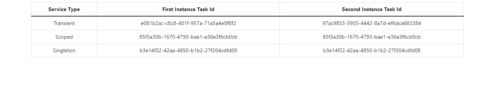
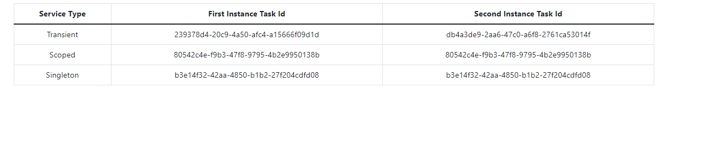

# Dependency Injection Lifetime 
### Dependency Injection Lifetime container'dan istenen objenin ne zaman instance create edileceğini ya da ne zaman yeniden create edilmesi gerektiğini sağlar.Container'da lifetime tanımını sağlayan 3 state bulunmaktadır.
### 1) Transient: Transient,servisden her yeni bir istek talep edildiğinde yeni bir instance yaratır.Bağlayıcılığı en az olan lifetime seçeneğidir.Çok fazla bellek ve kaynak kullanımı oluşturduğundan performans üzerinde olumsuz etkisi vardır.
### 2) Scoped:Scoped,Her bir istek için yalnızca bir kez instance yaratılmasını sağlayan lifetime seçeneğidir.Request cycle'ı tamamlanana kadar gerçekleşen servis çağrılarında daha önce oluşturulan instance gönderilir.Daha sonra yeni bir request geldiğinde farklı bir instance oluşturulur.
### 3) Singleton:Singleton,Uygulama ilk ayağa kalktığı anda ,servisin tek bir instance'ı oluşturularak memory'de tutulur ve daha sonrasında her servis çağrısında bu instance gönderilir.İnstance uygulama stop olana kadar aynı instance'ı kullanır.Loglama servislerinde genellikle singleton kullanılır.

## Sayfaya ilk istek atıldığında oluşan ID'ler :

### Görüldüğü üzere Aynı sayfa üzerinde transient instancelarının id'leri değişmekte , Scoped ve Singleton'un instancelarının id'leri değişmemektedir.Sayfayı yeniledeğimiz de ise: 

### Transient'in instanceları yine farklı,Bu sefer yeni bir istek oluşturulduğu için Scopeun da instanceının id'si farklı ama sayfa yenilenmesine rağmen Singleton'un id leri hep aynı kalmaktadır.

