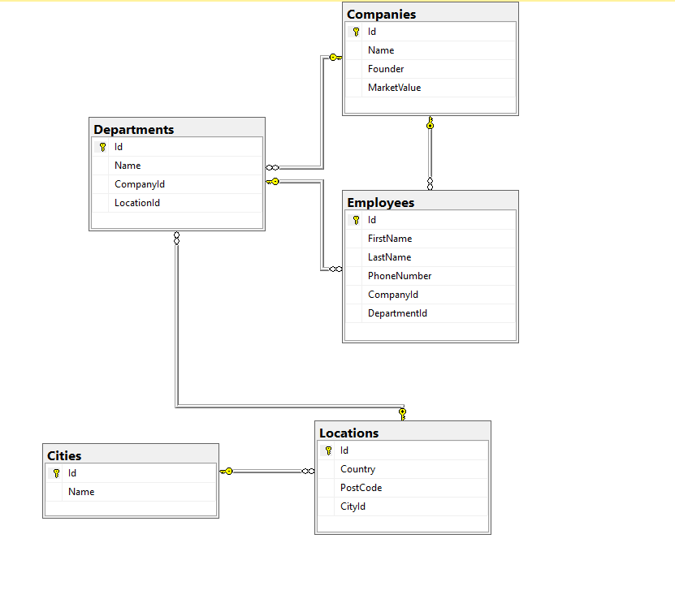
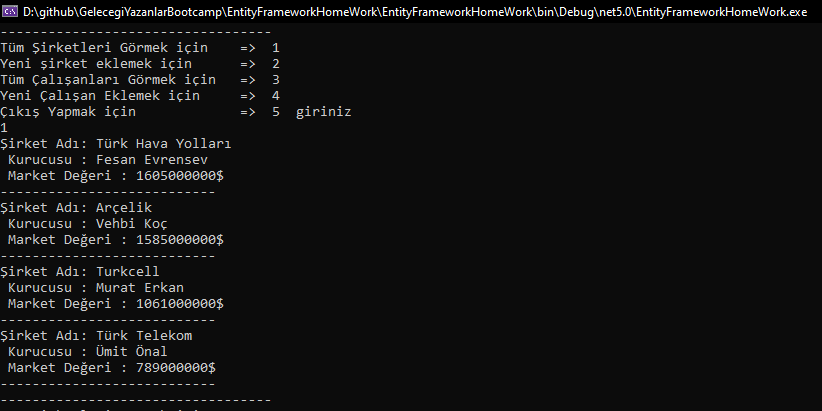
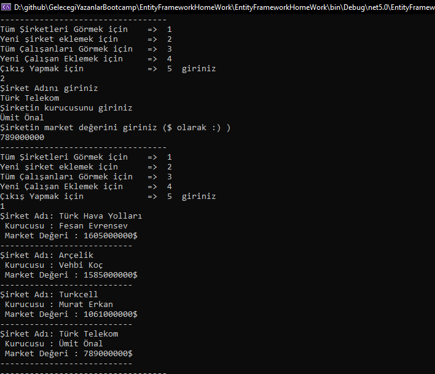
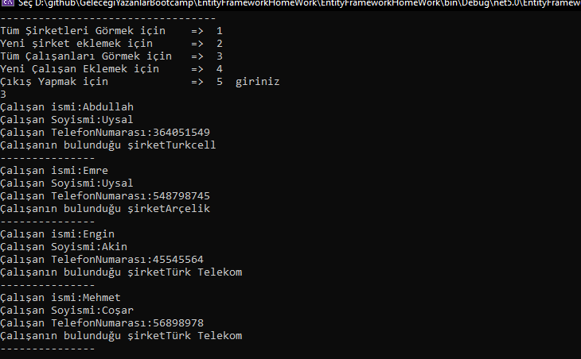
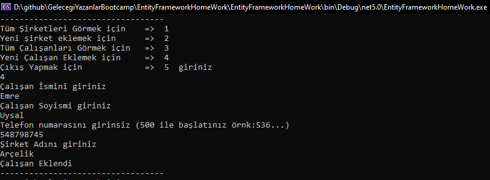

# Entity FrameWork HomeWork
## Kullanıcı Veritabanında bulunan Çalışanları ve Şirketleri görüntüleyebilmektedir ve bunlara yenilerini ekleyebilmektedir.
## Veritabanının diagram görüntüsü 

## Tüm şirketleri görüntülemek için

## Yeni Şirket bilgileri girmek için

## Tüm çalışanları görüntülemek için

## Yeni Çalışan eklemek için
